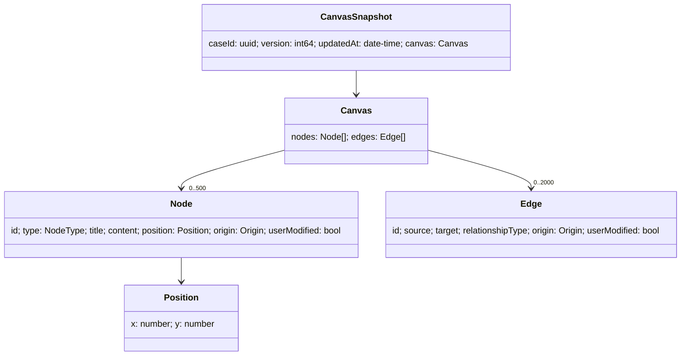
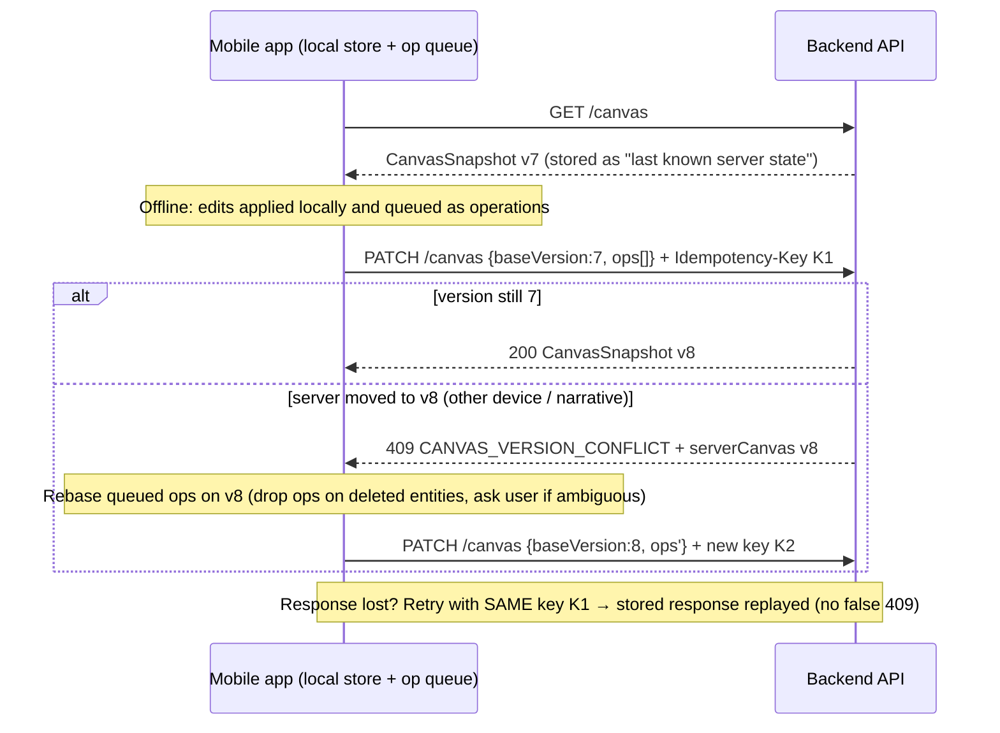

# Iurify Case — REST API & OpenAPI 3.1 Architecture

| Artifact | Purpose |
|---|---|
| [openapi.yaml](../openapi.yaml) | **Phase 3** — the full OpenAPI 3.1 contract (single file) |
| [canvas.schema.json](../schemas/canvas.schema.json) | Standalone JSON Schema 2020-12 for the canvas |
| This document | Phases 1, 2, 4 and 5 (analysis, schemas, traceability, self-validation) |

---

## PHASE 1 — API ARCHITECTURE ANALYSIS

### 1.1 Domain resources

The API is built around **domain resources**, not database tables.

| Resource | Cardinality | Route | Nature |
|---|---|---|---|
| Session / token | — | `/api/v1/auth/login` | Action (public) |
| Case | many per lawyer | `/api/v1/cases`, `/api/v1/cases/{caseId}` | Collection + item |
| Narrative | many per case | `/api/v1/cases/{caseId}/narrative` | Ingestion action (creates a narrative and changes the canvas) |
| Canvas | **one per case** | `/api/v1/cases/{caseId}/canvas` | Singleton sub-resource (so the name is singular) |
| Audit | computed on demand | `/api/v1/cases/{caseId}/audit` | Computation, no stored state |
| Document | many per case | `/api/v1/cases/{caseId}/documents[/{documentId}]` | Collection + item, async job |

Ownership is implicit: every case belongs to the lawyer identified by the JWT. Nesting under `/cases/{caseId}` shows that ownership and makes authorization simple: check the case once, and every child resource is covered.

### 1.2 Main operations

| Method & path | Semantics | Sync/Async | Idempotency |
|---|---|---|---|
| `POST /auth/login` | Credentials → JWT | Sync | n/a |
| `GET /cases` · `POST /cases` | List / create | Sync | `Idempotency-Key` on POST |
| `GET /cases/{id}` · `PATCH /cases/{id}` | Read / partial metadata update | Sync | PATCH idempotent by nature |
| `POST /cases/{id}/narrative` | Text (JSON) or voice (multipart) → STT → AI → canvas merge | Sync | `Idempotency-Key` |
| `GET /cases/{id}/canvas` | Last known server state | Sync | Safe |
| `PATCH /cases/{id}/canvas` | Incremental operation-based sync | Sync | `Idempotency-Key` + `baseVersion` |
| `POST /cases/{id}/audit` | AI analysis of a canvas version | Sync | Side-effect free → retry-safe |
| `POST /cases/{id}/documents` | Start document generation | **Async (202)** | `Idempotency-Key` |
| `GET /cases/{id}/documents[/{docId}]` | List / poll status and content | Sync | Safe |

> **Why the case CRUD endpoints exist:** you can't call `/cases/{caseId}/...` without a `caseId`, and "create and manage case files" is a stated capability. Delete is left out on purpose (see Phase 5, RAD-05).

### 1.3 Authentication model

- **JWT Bearer** (`components.securitySchemes.bearerAuth`), applied **globally**. Login opts out with `security: []`.
- The login response returns `accessToken`, `tokenType: "Bearer"`, `expiresIn` (relative seconds, so device clock skew doesn't matter) and the `user` profile the app needs (`id`, `email`, `fullName`).
- `Cache-Control: no-store` on the login response. `password` is `writeOnly` and is never returned.
- **Ownership is enforced as 404, not 403.** A case owned by someone else is reported as `CASE_NOT_FOUND`, so nobody can probe which confidential legal matters exist.
- Refresh tokens are **not** designed here (see RAD-01). This matters for offline use.

### 1.4 Canvas data model



- `Canvas` contains only `nodes` and `edges`, as required. The renderer and the AI layer both use exactly this shape.
- **Sync metadata (`version`, `updatedAt`, `caseId`) sits in a separate wrapper, `CanvasSnapshot`.** That keeps the graph schema clean and lets other payloads embed it (narrative result, conflict error).

### 1.5 Synchronization strategy — decision

| Option | Assessment for this app | Verdict |
|---|---|---|
| **JSON Merge Patch** (RFC 7396) | Arrays are replaced as a whole. You can't add or remove one node in `nodes[]` without resending all of them. You also can't express "delete" for array elements. | ❌ Rejected |
| **JSON Patch** (RFC 6902) | Addresses array elements **by index** (`/nodes/3`). Indexes shift when offline edits and server edits interleave, so a replayed patch can change the wrong node. It also exposes the storage layout and allows meaningless operations (e.g. `replace /nodes/2/origin`). | ❌ Rejected |
| **Custom operation-based payload** | Operations are domain verbs (`ADD_NODE`, `UPDATE_NODE`, `DELETE_NODE`, `ADD_EDGE`, `UPDATE_EDGE`, `DELETE_EDGE`) that address entities **by UUID**. It maps directly to an offline operation queue on the device and is easy to validate. The server can attach domain rules (cascade, provenance). | ✅ **Chosen** |

Rules (documented on `PATCH /canvas`):
1. **Client-generated UUIDs** for new nodes and edges, so they can be created offline and referenced in the same batch.
2. **Optimistic concurrency.** `baseVersion` must match the server version. Otherwise the server returns `409 CANVAS_VERSION_CONFLICT`, including the **current server snapshot** so the client can rebase without an extra round trip.
3. **Atomic, ordered batch.** Either all operations apply or none do. A failure returns `422` with `details.operationIndex`.
4. **Cascade.** `DELETE_NODE` also removes the node's edges.
5. **Edges cannot be reconnected.** Only `relationshipType` is mutable. Changing endpoints is a different legal assertion, so the client sends `DELETE_EDGE` + `ADD_EDGE`.
6. **Provenance is assigned by the server.** The client cannot set `origin` or `userModified`.
7. The response is the **full resulting `CanvasSnapshot`**. The client then holds exactly the server state, and at the ≤500-node limit the payload stays reasonable.

### 1.6 AI abstraction

- The mobile app only talks to the backend. No schema mentions a provider, model, prompt, token count, temperature or raw completion.
- AI output is shown as **business objects**: `Node`/`Edge` with `origin = AI_GENERATED`, `AuditAlert`, `Document`.
- Provider failures are reduced to **`502 AI_PROCESSING_FAILED` / `SPEECH_TO_TEXT_FAILED`** and **`503 SERVICE_UNAVAILABLE`**, with no internal detail. A `traceId` lets support find the internal logs.
- The backend must validate AI output against `Canvas` before persisting it. Invalid output → `502`, nothing persisted.
- **AI uncertainty scores (`confidence`) are left out on purpose** (see §2.1).

### 1.7 Error strategy

- One schema, `Error`: `{ code, message, traceId, retryable, details?, fieldErrors? }`. Phase 2 has the details.
- **400 vs 422.** 400 means the body couldn't be parsed. 422 means it parsed but breaks the schema or business rules.
- `retryable` tells the mobile client, on an unstable network, whether retrying makes sense. It doesn't have to work that out from the status code.
- `Retry-After` is sent with `429`, `503`, and `202`/polling responses.
- Status codes per endpoint are **only those that can actually occur** (e.g. `415` only on narrative ingestion, `502` only on AI/STT-backed endpoints). `403` isn't used (see 1.3); `404` covers it.

### 1.8 Offline synchronization strategy (deliberately minimal)



- **Idempotency-Key + version check together:** the version catches real conflicts, and the key keeps a successful but unacknowledged request from looking like a conflict when it's retried.
- AI operations (narrative, audit, documents) **need connectivity**. The app can queue a narrative locally and submit it later with its stored Idempotency-Key.
- Audit and documents send `canvasVersion`, so AI never analyses a canvas different from the one the lawyer sees (unsynced edits → `409`).
- Conflict granularity is the **whole canvas**. That fits the expected usage (one lawyer, a few devices). Finer-grained merging is RAD-03.

### 1.9 Key architectural decisions

| # | Decision | Rationale |
|---|---|---|
| AD-1 | Resource-oriented, nested under `/cases/{caseId}` | Ownership and authorization in one place |
| AD-2 | Custom operation-based canvas PATCH | See 1.5 |
| AD-3 | Integer `version` per canvas + `baseVersion` in body | Easy to store in an offline queue; clearer than `ETag`/`If-Match` for mobile developers and students |
| AD-4 | `Idempotency-Key` required on non-idempotent writes | Safe retries on unstable networks |
| AD-5 | Narrative ingestion is **synchronous** | The requirement says the endpoint returns the updated canvas. Long runs are handled by idempotent replay (RAD-04 if latency grows) |
| AD-6 | Document generation is **asynchronous (202 + polling)** | Long-form generation can exceed mobile/HTTP timeouts. Status is a first-class part of the document |
| AD-7 | Audit is synchronous and **not persisted** | Shorter output; results are tied to a version (RAD-06 for history) |
| AD-8 | Narrative merge = **append-only** | Never destroys lawyer work; RAD-02 covers regeneration |
| AD-9 | 404 instead of 403 for cases owned by someone else | Keeps the existence of confidential matters private |
| AD-10 | Path `/narrative` kept singular as specified | It's an ingestion action. Rename to `/narratives` if narratives become retrievable (RAD-07) |

---

## PHASE 2 — JSON SCHEMAS

All schemas are in `components.schemas` of [openapi.yaml](../openapi.yaml). The canvas subset is also published as a standalone [canvas.schema.json](../schemas/canvas.schema.json) (JSON Schema 2020-12, `$defs`).

### 2.1 Canvas, Node, Edge

**Fields beyond the minimum, and why**

| Candidate field | Decision | Reason |
|---|---|---|
| `origin` (`AI_GENERATED` \| `USER_CREATED`) | ✅ Included | Required to tell generated data from user data |
| `userModified` (boolean) | ✅ Included | An AI node later edited by the lawyer must be protected from AI overwrites. `origin` alone can't say that. Layout moves don't set it |
| `createdAt` / `updatedAt` per element | ❌ Excluded | Concurrency works at canvas level (`version`). Per-node timestamps add payload without feeding any v1 behaviour. `CanvasSnapshot.updatedAt` covers it |
| `metadata` (free-form) | ❌ Excluded | An open bag defeats `additionalProperties: false` and turns into an undocumented side channel |
| `source` (narrative excerpt) | ❌ Excluded (future) | Useful for traceability, but needs a stored Narrative resource (RAD-07) |
| `confidence` | ❌ Excluded | Uncalibrated LLM scores can mislead a legal professional and depend on the provider (they break the AI abstraction). The audit flags weaknesses instead |

**Relationship types, and why**

| Type | Typical pair | Justification |
|---|---|---|
| `SUPPORTS` | EVIDENCE → FACT | The core of proof |
| `CONTRADICTS` | EVIDENCE → FACT, FACT ↔ FACT | Required to detect contradictions |
| `DERIVES_FROM` | FACT → FACT | Inference chains / presumptions |
| `APPLIES_TO` | LAW / JURISPRUDENCE → FACT | Subsumption of facts under norms |
| `INTERPRETS` | JURISPRUDENCE → LAW | How precedent shapes the norm |
| ~~`REFERENCES`~~ | — | Replaced by the more precise `APPLIES_TO` / `INTERPRETS` |
| ~~`RELATED_TO`~~ | — | Carries no meaning: the audit can't reason over it and the AI would overuse it |

Type pairs are **guidance, not hard constraints**. A lawyer may model unusual situations, and odd pairs come back as `STRUCTURAL_ISSUE` alerts.

**Strictness decisions**
- `additionalProperties: false` on every object. Explicit `required`. Enums for `type`, `relationshipType`, `origin`.
- UUIDs use `format: uuid` **plus a `pattern`**. In 2020-12, `format` only annotates unless the validator enables format assertion; the pattern makes validation certain.
- `title` must contain a non-whitespace character (`pattern: "\S"`). `content` may be empty (e.g. a LAW node identified only by its title).
- `position` is bounded to ±100 000 logical units. Values are device-independent; the app handles zoom and scale.
- `maxItems` 500 nodes / 2000 edges keeps payload and AI context bounded (assumption A-6).
- No nullable fields. Optional values are **omitted**, never `null`.
- **Invariants JSON Schema can't express** (unique ids, edge endpoints exist, no self-loops) are enforced by the server → `422 CANVAS_INTEGRITY_VIOLATION`.
- Write models are separate from read models: `NodeInput`/`EdgeInput` (client) leave out `origin`/`userModified` (server-owned). `NodeChanges`/`EdgeChanges` use `minProperties: 1`. They share primitives (`NodeTitle`, `Position`, …) so nothing is defined twice.

### 2.2 Canvas sync schemas

`CanvasSyncRequest { baseVersion, operations[1..500] }`. `CanvasOperation` is a `oneOf` with a `discriminator` on `op` (each variant uses `const`), so code generators produce proper tagged unions.

### 2.3 Narrative schemas

| Schema | Content type | Notes |
|---|---|---|
| `TextNarrativeRequest` | `application/json` | `inputType: const TEXT`, `text` 1–50 000 chars, optional BCP 47 `language` |
| `VoiceNarrativeRequest` | `multipart/form-data` | `inputType: const VOICE`, `audio` binary part (`contentMediaType: audio/*`), optional `language`. The codec list is server config, reported in the `415` details |
| `NarrativeProcessingResult` | response | `narrativeId`, `generatedNodeIds/EdgeIds` (UI highlighting), `canvas: CanvasSnapshot`. `transcript` is **required for VOICE and forbidden for TEXT** (`if/then/else`) so the lawyer can check what the STT understood |

### 2.4 Audit Alert schema

`AuditAlert { id, severity, type, title, description, recommendation?, relatedNodeIds[], relatedEdgeIds[] }`

| Field | Justification |
|---|---|
| `id` | Stable list key in the UI; lets the lawyer dismiss or give feedback later |
| `severity` `HIGH/MEDIUM/LOW` | Three levels a lawyer can act on (defeats claim / weakens / improvement) |
| `type` | `PROCEDURAL_GAP`, `LOGICAL_CONTRADICTION`, `EVIDENCE_CONFLICT`, `UNSUPPORTED_FACT`, `MISSING_LEGAL_BASIS`, `CASE_THEORY_WEAKNESS`, `STRUCTURAL_ISSUE`. Each one maps to a required audit capability |
| `relatedNodeIds` / `relatedEdgeIds` | Highlight on the canvas. Always present, may be empty (a *gap* points at something missing). Edges matter because a contradiction is often a relationship |
| `recommendation` (optional) | Turns the finding into an action; omitted when there's nothing concrete to suggest |

`AuditReport { auditId, caseId, canvasVersion, generatedAt, alerts[] }`. The report states which version it analysed.

### 2.5 Document schemas

```
Document
├── id
├── metadata    → DocumentMetadata   (caseId, documentType, title, language, sourceCanvasVersion, instructions?)
├── generation  → DocumentGeneration (status, requestedAt, completedAt?, failure?)
└── content?    → DocumentContent    (format: MARKDOWN, body)   — present iff status = COMPLETED
```

- Metadata, generation status and generated content are three separate sub-objects.
- Conditional rules (`if/then`): `completedAt` is required when the job is terminal, `failure` only when `FAILED`, `content` only when `COMPLETED`.
- `DocumentSummary` (list view) leaves out `content` to keep list payloads small.
- Document types are kept to the three required ones. Candidates such as `CASE_SUMMARY` or `COMPLAINT` aren't added without a requirement (RAD-08).

### 2.6 Authentication schemas

`LoginRequest { email (format email), password (writeOnly, ≤128) }` → `AuthTokenResponse { accessToken, tokenType: const "Bearer", expiresIn, user: UserProfile { id, email, fullName } }`.

### 2.7 Error schema

| Field | Req. | Purpose |
|---|---|---|
| `code` | ✅ | Stable machine code (`UPPER_SNAKE`). Clients branch on it |
| `message` | ✅ | Safe text to show the user. Never contains stack traces, SQL, provider names or prompts |
| `traceId` | ✅ | Correlates with server logs without exposing them |
| `retryable` | ✅ | Retry hint for unstable mobile networks |
| `details` | — | Extra data specific to the code (`maxBytes`, `supportedMediaTypes`, `operationIndex`) |
| `fieldErrors[]` | — | `{ pointer (RFC 6901), code, message }` for 400/422 |

`CanvasVersionConflictError` is a specialised variant with typed `details { clientVersion, currentVersion, serverCanvas }`. The `409` response uses `anyOf` because the same endpoint can also return a generic `IDEMPOTENCY_REQUEST_IN_PROGRESS`.

> RFC 9457 *Problem Details* was considered. The flat `code/message/details` model was kept because it matches the specified concept and is simpler for mobile developers. Migrating stays possible (RAD-09).

**Error catalogue**

| HTTP | `code` | Used by |
|---|---|---|
| 400 | `MALFORMED_REQUEST` | all endpoints with a body |
| 401 | `AUTHENTICATION_REQUIRED`, `TOKEN_INVALID`, `TOKEN_EXPIRED` | all protected endpoints |
| 401 | `INVALID_CREDENTIALS` | login |
| 404 | `CASE_NOT_FOUND`, `DOCUMENT_NOT_FOUND` | case sub-resources |
| 409 | `CANVAS_VERSION_CONFLICT` | canvas PATCH, audit, documents |
| 409 | `IDEMPOTENCY_REQUEST_IN_PROGRESS` | endpoints with `Idempotency-Key` |
| 413 | `PAYLOAD_TOO_LARGE` | narrative, canvas PATCH |
| 415 | `UNSUPPORTED_MEDIA_TYPE` | narrative |
| 422 | `VALIDATION_FAILED`, `CANVAS_INTEGRITY_VIOLATION`, `NO_SPEECH_DETECTED`, `IDEMPOTENCY_KEY_REUSED`, `TEXT_TOO_LONG` | per endpoint |
| 429 | `RATE_LIMIT_EXCEEDED` | login, AI endpoints |
| 500 | `INTERNAL_ERROR` | all |
| 502 | `AI_PROCESSING_FAILED`, `SPEECH_TO_TEXT_FAILED` | narrative, audit |
| 503 | `SERVICE_UNAVAILABLE` | narrative, audit, documents |

---

## PHASE 3 — OPENAPI 3.1

➡️ **[openapi.yaml](../openapi.yaml)** — complete, self-contained, `openapi: 3.1.0`, `jsonSchemaDialect` set to the OAS 3.1 base dialect.

Structure: `paths` (12 operations over 8 paths) · `components.securitySchemes` (1) · `components.parameters` (6) · `components.headers` (4) · `components.responses` (12) · `components.schemas` (63).

---

## PHASE 4 — TRACEABILITY

> [!IMPORTANT]
> FR-001…FR-008 and NFR-001…NFR-004 were **not defined** in the brief or the repository. The labels below are **inferred** from the capabilities in §1 and §2–§15 of the brief, in the order they appear. Confirm them against the official requirements document (MI-01).

| Requirement (inferred) | Endpoint / Schema | Purpose |
|---|---|---|
| **FR-001** Create and manage case files | `POST/GET /cases`, `GET/PATCH /cases/{caseId}` · `Case`, `CreateCaseRequest`, `UpdateCaseRequest`, `CaseList` | Case life cycle and ownership scope |
| **FR-002** Enter narrative by text | `POST /cases/{caseId}/narrative` (`application/json`) · `TextNarrativeRequest` | Typed narrative intake |
| **FR-003** Dictate narrative by voice | `POST /cases/{caseId}/narrative` (`multipart/form-data`) · `VoiceNarrativeRequest`, `NarrativeProcessingResult.transcript` | Audio intake + transcript the lawyer can verify |
| **FR-004** AI processing & legal extraction | `POST /narrative` → `NarrativeProcessingResult` · `Node.type`, `Origin=AI_GENERATED`, `502/503` | Extract facts, evidence, norms and case law as business objects |
| **FR-005** Generate interactive canvas (graph) | `Canvas`, `Node`, `Edge`, `Position`, `CanvasSnapshot` · `GET /canvas` | Graph contract for rendering |
| **FR-006** Manually edit canvas | `PATCH /canvas` · `CanvasSyncRequest`, `CanvasOperation` (6 ops), `userModified` | Incremental, conflict-aware editing |
| **FR-007** AI audit (gaps, contradictions, weaknesses) | `POST /audit` · `AuditRequest`, `AuditReport`, `AuditAlert`, `AlertType`, `AlertSeverity` | Structured findings linked to nodes and edges |
| **FR-008** Generate legal documents | `POST/GET /documents`, `GET /documents/{documentId}` · `DocumentGenerationRequest`, `Document`, `DocumentStatus` | Async generation pinned to a canvas version |
| **NFR-001** Security / confidentiality | `bearerAuth` (global), `security: []` only on login, `writeOnly` password, `no-store`, 404-not-403, `Error` without internals, `429` | Protect highly sensitive legal data |
| **NFR-002** Mobile offline / network resilience | `CanvasVersion`, `baseVersion`, `CanvasVersionConflictError`, `Idempotency-Key`, `retryable`, `Retry-After`, client UUIDs | Safe retries, conflict detection, last known state |
| **NFR-003** Interoperability, versioning, implementation independence | `/api/v1` prefix, OpenAPI 3.1 + JSON Schema 2020-12, closed schemas, tolerant-reader rule | Stable polyrepo contract, works with FastAPI or Node |
| **NFR-004** AI / STT provider abstraction | Business-level schemas only; `502 AI_PROCESSING_FAILED / SPEECH_TO_TEXT_FAILED`; no provider fields | Swap providers without breaking clients |

**Not directly representable in the contract**
- Encryption at rest, audit logging, data residency and retention (NFR-001) are infrastructure concerns. The API can only avoid leaking data.
- Latency/SLA targets (likely an NFR) can't be expressed in OpenAPI; they belong in an SLO document.
- Output quality of AI extraction/audit (FR-004/FR-007) needs an evaluation plan, not a schema.

---

## PHASE 5 — SELF-VALIDATION

### 5.1 Checklist

| # | Check | Result |
|---|---|---|
| 1 | OpenAPI 3.1 syntax (`openapi: 3.1.0`, `const`, `if/then`, `contentMediaType`, `examples`) | ✅ Manual review. No Node/Python on the machine, so no automated linter run (see note) |
| 2 | All `$ref` resolve | ✅ Script check: 85 unique refs, 0 missing, 0 unused components |
| 3 | All request bodies have schemas | ✅ 7 bodies, all `$ref` to named schemas |
| 4 | All success responses have schemas | ✅ (200/201/202) |
| 5 | Protected endpoints use JWT | ✅ Global `bearerAuth`; only login overrides it with `[]` |
| 6 | JSON vs multipart correct | ✅ Multipart only on narrative (voice), with `encoding` |
| 7 | UUID formats | ✅ Single `Uuid` primitive (`format` + `pattern`) |
| 8 | Enum consistency | ✅ Each enum defined once, used by `$ref` |
| 9 | Consistent errors | ✅ 12 reusable responses, one `Error` shape + one typed conflict variant |
| 10 | Unique schema names | ✅ |
| 11 | No unnecessary circular refs | ✅ None (the conflict error embeds a snapshot; that isn't a cycle) |
| 12 | Consistent paths | ✅ `/api/v1/...`, plural collections, singular singletons |
| 13 | HTTP method semantics | ✅ GET safe; PATCH partial; POST for creation/computation; 202 for async |
| 14 | Canvas schema reused | ✅ `Canvas` in `CanvasSnapshot` → narrative result, GET/PATCH canvas, conflict error |
| 15 | No AI internals exposed | ✅ |
| 16 | Offline sync supported | ✅ Version + idempotency + client ids + conflict payload |
| 17 | Consistent with FRs | ✅ See Phase 4 (pending MI-01) |

> [!NOTE]
> Recommended CI step once Node.js is available: `npx @redocly/cli lint openapi.yaml` and an Ajv 2020 validation of `canvas.schema.json` against sample payloads.

### 5.2 Missing information

| ID | Missing |
|---|---|
| MI-01 | Official text of FR-001…FR-008 and NFR-001…NFR-004 |
| MI-02 | Jurisdiction/legal system(s) targeted. This affects AI extraction, procedural-gap rules and document templates; it may need a `jurisdiction` field on `Case` |
| MI-03 | Audio limits (max size, max duration) and supported container/codec list for the mobile platforms |
| MI-04 | Token lifetime and session policy |
| MI-05 | Data-retention and legal confidentiality obligations (deletion, export) |

### 5.3 Required architectural decisions

| ID | Decision needed | Options / recommendation |
|---|---|---|
| **RAD-01** | **Session renewal.** Access tokens may expire while the lawyer is offline; without renewal they must re-enter the password | Add `POST /auth/refresh` with rotating refresh tokens (recommended), or long-lived tokens (weaker) |
| **RAD-02** | **Narrative re-processing.** Should a new narrative only append, or also regenerate/dedupe existing AI nodes? | v1 = append-only. Regeneration would need a `mergeStrategy` field that never touches `USER_CREATED`/`userModified` elements |
| **RAD-03** | **Conflict granularity.** Whole-canvas versioning causes a 409 on any concurrent change | Fine for one lawyer. Shared cases would need per-entity versions or server-side merging of non-overlapping operations |
| **RAD-04** | **Narrative latency.** If STT + LLM regularly exceed about 30 s, synchronous calls become unreliable on mobile | Move to the same 202 + polling job pattern used by documents |
| **RAD-05** | **Case deletion.** Hard delete vs archive vs retention-bound deletion | Only `ARCHIVED` status for now; deletion waits on MI-05 |
| **RAD-06** | **Audit history.** Should reports be stored and listed? | Add `GET /cases/{id}/audits` if needed (would rename the path to plural) |
| **RAD-07** | **Narrative as a stored resource** (view past narratives/transcripts, link nodes to source excerpts) | Would justify `/narratives` (plural) and a node `source` reference |
| **RAD-08** | **More document types** (e.g. `CASE_SUMMARY`, `COMPLAINT`, `APPEAL`) and **export formats** (PDF/DOCX) | Extend the enums; add an export endpoint or `Accept`-based negotiation |
| **RAD-09** | **Error media type**: custom JSON vs RFC 9457 `application/problem+json` | Custom JSON kept for v1 |
| **RAD-10** | **Multi-user / firm sharing** (paralegals, co-counsel) | Would bring back `403` and roles in `UserProfile` |

### 5.4 Assumptions

| ID | Assumption |
|---|---|
| A-1 | One lawyer owns each case; there's no sharing in v1 |
| A-2 | One canvas per case |
| A-3 | The AI service can return the four node types and five relationship types defined here |
| A-4 | Idempotency records are kept for at least 24 h |
| A-5 | Document content is returned as Markdown; rendering and export are client concerns |
| A-6 | Limits (500 nodes, 2000 edges, 500 ops/batch, 50 000 narrative chars, 200/10 000 chars title/content) are starting values to tune |
| A-7 | `language` defaults to an account-level setting when omitted |
| A-8 | AI output is always a draft for professional review; the contract doesn't certify legal correctness |
